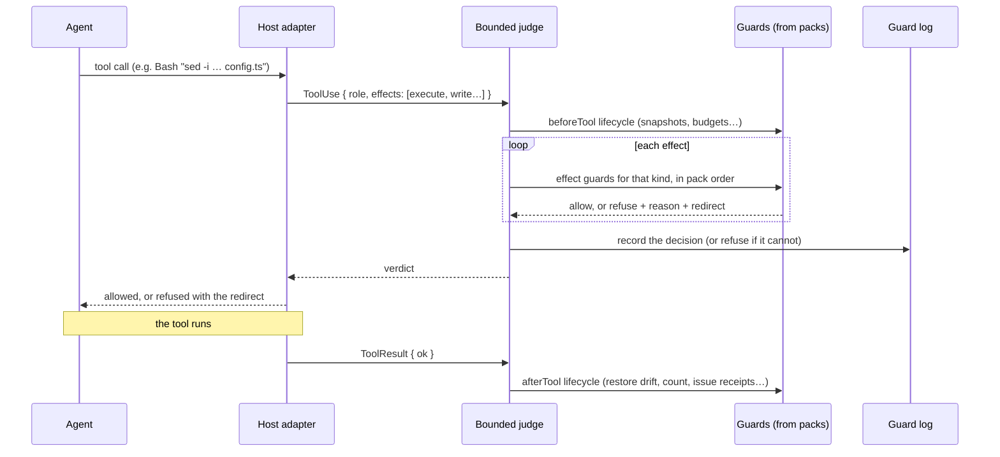

# Bounded: the vision

> **Say the rule once.** Bounded turns each rule into four things for the
> agent: an instruction it reads before it starts, a check on every action,
> a redirect when it goes wrong, and a record afterwards. This works for any
> agent host, with rules that come in packs you can compose, type-check and
> share.

This document describes where Bounded is going. It is a vision, not a
commitment: what exists today is in [flight-state.md](flight-state.md), what
is required is in [spec.md](spec.md), and each item here becomes real only
through an ADR and the [development lifecycle](development-workflow.md).
Code marked *proposed* shows the intended shape, not a published API.

---

## 1. The problem

Coding agents are fast, tireless and literal. They also:

- edit the generated file instead of the generator's input;
- run `npx jest` in a project that uses `bun test`;
- "fix" a failing test by deleting its assertion;
- report that the tests pass when they last ran three edits ago;
- try the same failing command forty times;
- push, deploy or `rm -rf` when you meant them to ask first.

The usual answers to this don't hold up well:

- **Prose instructions** (`AGENTS.md`, `CLAUDE.md`, rules files) are
  suggestions. The agent reads them once and forgets them under pressure.
- **Deny-lists in host settings** are per-host, per-tool and silent about
  what to do instead: "permission denied" teaches nothing, so the agent
  tries a different route to the same mistake.
- **Hand-written hook scripts** work, but they don't compose. Every team
  rewrites the same twenty checks, for each host it uses, with no types,
  tests or way to share them.

What is missing is a **platform for engineering rules**, the equivalent of
a linter's plugin ecosystem, aimed at agents' actions rather than at code.

## 2. What Bounded is

Bounded is a small, pure core, plus **packs**: selectable bundles of
behaviour that extend each other through typed extension points. A project
picks its packs in one file, `bounded.config.ts`. A thin **host adapter**
for each agent host (Claude Code, pi, Codex, Copilot, Cursor, Grok and
others) turns the host's hooks into Bounded's host-neutral events and its
verdicts back into the host's answers.

Every rule in Bounded does four jobs:

| When | What the rule does | How |
|---|---|---|
| **Before** | It tells the agent the rule exists, in the role's brief and the project's instructions | Packs contribute instructions, skills and agent briefs (section 6) |
| **During** | It checks every action | Guards judge each effect of each tool call |
| **At refusal** | It names the next permitted step | Every refusal carries a *redirect*, not just a "no" |
| **After** | It leaves evidence | Every decision is recorded, and a decision that cannot be recorded is refused |

A rule written once in a pack shows up in all four places, so the agent's
instructions and the enforcement can never drift apart.

## 3. The core ideas

### Effects: what an agent is actually doing

Hosts name their tools differently (`Edit`, `apply_patch`, `write_file`,
`str_replace`), and the same tool can do several things at once. Bounded
does not reason about tool names. It reasons about **effects**:

| Effect | Meaning |
|---|---|
| `read` | reads a file's contents |
| `list` | lists names under a directory |
| `write` | creates, modifies or deletes a file |
| `execute` | runs a shell command |
| `fetch` | reaches the network |
| `delegate` | hands work to another agent |
| `invoke` | calls a tool the host cannot describe (an MCP tool, a skill) |

A tool call is a **list of effects**. A guard is written once, for one
effect kind, and it works on every host and for every tool that has that
effect, including tools that don't exist yet.

### Packs and extension points

A **pack** has an id rooted at its npm package, the packs it depends on, the
**extension points** it declares, and its **contributions** to the points
of the packs it depends on. Here is the path gate, the first shipped pack,
in full:

```ts
export const pathGate: PathGate = definePack({
  id: pathGateId,
  dependsOn: [corePack],
  points: { protectedPaths: protectedPathsPoint },
  contributes: [
    contribution(corePack.points.effectGuards.read, [judgeRead]),
    contribution(corePack.points.effectGuards.write, [judgeWrite]),
    contribution(corePack.points.effectGuards.execute, [judgeExecute]),
    contribution(corePack.points.beforeTool, [snapshotBeforeShell]),
    contribution(corePack.points.afterTool, [restoreWatched]),
  ],
  ports: { watchedFiles: watchedFilesPort, shellSnapshots: shellSnapshotsPort /* … */ },
});
```

The path gate offers one point, `protectedPaths`. Any pack that depends on
it, and the project itself, can contribute rules there:

```ts
contribution(pathGate.points.protectedPaths, [
  {
    match: "generated/**",
    deny: ["create", "modify", "delete"],
    why: "generated/ is written by the generator",
    redirect: "Change the generator's input instead",
  },
]);
```

The typing is strict, and that is the design:

- **A contribution across an undeclared dependency does not compile.** A
  pack can only contribute to the points of packs it lists in `dependsOn`.
  Imports *are* the dependency graph.
- **Values are exactly the point's type.** A rule with a typo in a key is a
  compile error, and also a run-time refusal if it arrives as untyped data.
- **Composition is per project.** A pack that is not selected leaves no
  trace, and the result never depends on the order packs were listed in.
- **Every composition failure names the pack, the point and the fix.**

### Verdicts with redirects

A guard returns **allow**, or **refuse with a reason and a redirect**. The
redirect is required: it is the next permitted step, such as "change the
generator's input instead", "run `bun test`, not `npx jest`" or "write
the follow-up in `follow-ups.md`; this file is outside your task".
Refusals become teaching moments, and agents recover instead of looping.

### Fail closed, record everything

A missing, unreadable or malformed input is a refusal with an actionable
message, never "contributes nothing". A configuration that cannot be used
refuses every event. Every decision is written to the guard log, and a
decision that cannot be recorded within its time bound is refused.

### The project is a pack too

`defineConfig` turns the project's own contributions into the pack
`bounded/project`, which depends on every selected pack. Projects follow
exactly the same rules as any pack. There is one mechanism, and no special
cases.

## 4. How a tool call is judged



The first refusal wins and names the pack and the effect. A guard that
throws counts as a refusal. With no guards, the call is allowed.

## 5. Hosts: write once, guard every agent

Most agent hosts now let a hook run before a tool call and block it, and
that is all an adapter needs. Bounded's adapters are deliberately thin:
they translate, and decide nothing.

| Host | Status |
|---|---|
| Claude Code | Built (PreToolUse, PostToolUse, PostToolUseFailure) |
| pi | Built (in-process extension) |
| GitHub Copilot | Next. Its hooks read Claude Code's hook format, so the adapter is close to free |
| Grok Build CLI | Next. It reports compatibility with existing hook configs |
| Codex CLI | Planned. It has a pre-tool hook, and its gaps need tracking |
| Cursor, Gemini CLI, Kiro, Windsurf, Cline, OpenCode, Amp | Planned |

Hosts differ in what they can enforce. Some can't hook reads; some treat
errors as "allow"; some ignore anything but deny. Bounded will publish an
**honest coverage matrix**, generated from the adapters: which effects,
verdicts and lifecycle steps each host supports, and what a pack loses
there. Where a host cannot enforce a rule, the guard log says so, and
nothing pretends otherwise.

**Bounded is a guardrail, not a security boundary.** An agent running as
your user can always get round a hook. Bounded discourages, redirects and
records, and it pairs naturally with an operating-system sandbox, which can
eventually be generated from the same rules.

## 6. Say it once: instructions, skills and agents

So far this document has covered enforcement. The other half of guiding an
agent is what it *knows* before it acts: the project's instructions, the
skills it can call on, and the agents (roles) a session is divided into.
Today every host keeps these in its own files (`AGENTS.md`, `CLAUDE.md`,
`.claude/skills/`, `.claude/agents/`, `.github/agents/`, `.cursor/rules/`),
written by hand and drifting away from what is actually enforced.

Bounded makes them pack contributions, through a **guidance** pack
(*proposed*, `bounded/guidance`) that declares three points:

| Point | A contribution is | Rendered by host adapters as |
|---|---|---|
| `instructions` | A titled section of project guidance, ordered by pack dependency | `AGENTS.md`, `CLAUDE.md`, Copilot instructions, Cursor rules… |
| `skills` | A skill: name, description, body and resources, plus which roles may use it | `.claude/skills/<name>/SKILL.md` and each host's equivalent |
| `agents` | An agent (role): purpose, brief, tools, model tier and the seat it binds | `.claude/agents/<name>.md`, `.github/agents/…`, pi role configs |

Packs written in this way are a central idea of the vision:

- **Skill packs.** A pack can ship skills the same way it ships guards. A
  `grill-me` pack contributes a design-interrogation skill; a
  `postgres-migrations` pack contributes the migration runbook skill *and*
  the guards that enforce it. Install the pack and the agent gets the
  know-how and the guardrails together, versioned as one.
- **Contributions to agents.** An agent is declared by one pack, and its
  brief is *composed* from contributions by others. A `workflow` pack
  declares `builder`; a `typescript-strict` pack, which depends on it, adds
  "no `any`, no `as`, no `!`" to the builder's brief; the project adds its
  own conventions. The same typed rules apply: you can only extend the
  agents of packs you depend on.
- **AGENTS.md generated from what is enforced.** Every rule a selected pack
  enforces carries an id and a one-line description. The guidance pack
  renders a section called "Rules you will be held to" from them, grouped by
  role, so the instructions describe the enforcement because they are
  generated from it. A test can check that no enforced rule is missing from
  the brief of the role it binds.
- **Written at install, then protected.** `bounded update` renders the files
  for each host the project uses, marks them as generated, protects them
  from the agent and checks them for drift. Hand-written sections are kept
  in a project-owned file that the guidance pack includes, so nothing a
  person wrote is ever overwritten.

Tool-gate closes the loop: the skills and subagents an agent may invoke are
exactly the ones the guidance pack declared for its role.

## 7. The pack catalogue

Each pack below is small: one rule shape, a few lines of configuration, and
many uses. They all build on one shared foundation, **selectors**.

### Foundations

| Pack | What it gives you |
|---|---|
| **selectors** | Named effect patterns the whole project shares: `tests = write("**/*.test.ts")`, `commit = run("git commit *")`, `checkPassed = run("bun run check").succeeded()`. Every other pack refers to them by name, so each pack is just "selector → rule → redirect" |
| **seats** | Roles bound from *outside* the session, so an agent cannot choose its own. Unbound subagents get the least-privilege seat, and any rule in any pack can carry `when: seat` |
| **guidance** | Instructions, skills and agents as contributions (section 6) |
| **path-gate** | *Built.* Deny-only protected paths with honest redirects; restores protected files after shell commands change them |

### Gates: where and what

| Pack | What it gives you |
|---|---|
| **command-gate** | Refuse or redirect shell commands: "`bun test`, not `npx jest`", "never `git push --force`" |
| **egress** | Network allowlist by origin; offline mode in one line |
| **tool-gate** | Allowlist MCP tools, skills and subagents, per seat |
| **zones** | Allow-only territory per seat: "the architect writes only contracts" |
| **blindness** | Information barriers: the test-writer can't read the implementation, and test output is cleaned of test source before the builder sees it |
| **content-gate** | Rules on *what* is written: no secrets, no `.only`, no `any`, no `console.log` in `src` |
| **supply-chain** | New dependencies: registry allowlist, minimum version age, no install scripts, licence allowlist, a reason for each |
| **generated** | Files that belong to a generator: never hand-edited, never stale, synced without overwriting real work |

### Workflow: when

| Pack | What it gives you |
|---|---|
| **phases** | A tiny state machine; transitions fire on selectors (`red → green` once a tests-only commit succeeds) |
| **obligations** | Ordering and freshness: "after the schema changes, codegen must succeed before tests run" |
| **red-first** | New tests must fail, for the expected reason, before implementation exists, and are never weakened afterwards |
| **co-change** | Files that move together: routes with the API spec, env vars with `.env.example` |
| **declarations** | Some actions need a short written statement first: a rollback plan before a migration |
| **exit-gate** | A definition of done: the agent cannot stop while checks are red or obligations are still open |
| **calendar** | Time windows any rule can use: freezes, no Friday deploys, read-only during an incident |

### Evidence: proof, not claims

| Pack | What it gives you |
|---|---|
| **receipts** | A passing check issues a receipt bound to the exact tree hash; commit, merge or "done" requires one for the *current* tree |
| **ratchet** | Numbers that only move one way: test count, coverage, warnings, bundle size |
| **surface-lock** | The public surface (exported types, routes, schema, CLI flags) changes only with a version bump, changelog entry or ADR |
| **jobs** | Long checks run detached and answer RUNNING; the same check never runs twice at once |

### Control and recovery

| Pack | What it gives you |
|---|---|
| **budgets** | Counters with limits: "3 identical failures, then stop and summarise" |
| **churn** | Spots an agent going round in circles and asks for a new approach |
| **escalation** | A defined path when stuck: stronger model, then reviewer, then human |
| **checkpoints** | A shadow commit before selected calls; undo any agent turn |
| **reversibility** | Rates effects by how easily they can be undone; "irreversible → checkpoint or ask" in one line |
| **rewrite** | Canonical inputs: the model tier per role, foreground workers, a fixed test environment (visible and logged) |

### Collaboration

| Pack | What it gives you |
|---|---|
| **scope** | A task's territory, plus path leases so parallel agents never edit the same file |
| **two-key** | A second signature, from a reviewer agent or a human, for selected actions |
| **separation-of-duties** | Whoever wrote the change cannot approve it; whoever wrote the tests cannot weaken them |
| **mirror** | Gate results posted to your issue tracker; gates wait while an update is pending |

### Defence

| Pack | What it gives you |
|---|---|
| **canaries** | Honeypot files and fake keys; touching one locks the session down |
| **taint** | After reading untrusted content, egress, push and secrets need a human |
| **footprint** | Leave no trace outside the project: no global installs, stray containers or background processes |

### Meta: packs about rules

| Pack | What it gives you |
|---|---|
| **briefs** | Context at the moment of need: the first read under `packages/db/` brings in that folder's conventions |
| **rehearsal** | Observe mode ("would have refused") and replay of past guard logs against a new configuration: CI for your rules |
| **rule-miner** | Learns from your corrections and proposes new rules as a diff to `bounded.config.ts`; never applies them itself |
| **oracle** | For rules too fuzzy for patterns, a model or reviewer agent decides; when unsure it refuses or asks, never guesses allow |
| **chaos** | Evaluation-only fault injection: do agents recover, and do the redirects lead them to the right place? |

### Content packs

Language and framework knowledge lives in **content packs** that sit on top
of the generic ones. For example, `typescript-strict` contributes AST lint
rules to receipts, banned escape hatches to content-gate and brief lines to
the builder. `hexagonal` contributes layer rules; `postgres-migrations`
contributes obligations, declarations and a skill. The core never learns a
language's name; packs do.

## 8. Recipes

A **recipe** is a pack with almost no code of its own: it depends on a set
of packs and configures them to work together. Selecting a recipe is one
line, and a project can still override any of it, through the same typed
points.

```ts
// bounded.config.ts (proposed)
import { contribution, corePack, defineConfig } from "bounded/domain";
import { selectors, write } from "@bounded/selectors";
import { strictTdd } from "@bounded/recipe-strict-tdd";

export default defineConfig({
  packs: [corePack, strictTdd, ...strictTdd.requires],
  contributes: [
    contribution(selectors.points.named, { tests: write("src/**/*.test.ts") }),
  ],
});
```

| Recipe | Packs | What you get |
|---|---|---|
| **Strict TDD** | phases, zones, content-gate, ratchet, red-first, separation-of-duties | Only tests are writable in `red`; every new test fails first; no `.skip`; the test count never drops; nobody weakens their own tests |
| **Honest done** | receipts, exit-gate, co-change | "Done" means the checks passed on this exact tree and the docs moved with the code |
| **The agent pipeline** | seats, zones, blindness, guidance, phases, receipts, red-first, two-key, escalation | Architect, test-writer, builder and reviewer agents, blind to each other's side, through design → red → green → deliver. This reproduces the original Bounded harness as configuration |
| **Database migrations** | obligations, briefs, declarations, reversibility, checkpoints, two-key | Codegen after schema changes, a rollback plan, a checkpoint and a second key before `migrate` |
| **Production safety** | command-gate, egress, tool-gate, calendar, two-key | No prod hosts or tools, no deploys in freeze windows, two keys for anything live |
| **Prompt-injection defence** | canaries, taint, egress, supply-chain | Tripwires, untrusted-content tracking and a closed network |
| **Library maintainer** | surface-lock, ratchet, co-change, supply-chain | No accidental breaking changes; changelog with every API change |
| **Parallel workers** | scope, budgets, obligations, exit-gate, footprint | Leased territory, per-worker limits, checks before commit, a clean machine |
| **Loop control** | budgets, churn, escalation, briefs | Three identical failures bring in the debugging checklist; a fourth escalates |
| **Safe rule rollout** | rehearsal, chaos, rule-miner | Observe, test the redirects, then enforce, and let real corrections propose the next rule |

## 9. The registry: git first

There is no separate package server. A pack is an npm package (its id is
already rooted at its package name), so **npm is the distribution** and a
git URL (`github:org/repo#tag`) works as well.

- **Provenance.** Packs run inside the agent's hooks, so trust matters.
  Published packs carry npm provenance, which links each tarball to the
  commit and CI run that built it. The supply-chain pack governs pack
  installs like any other dependency.
- **Compatibility.** Each pack declares `bounded` as a peer dependency, and
  composition refuses an incompatible core with a fix message.
- **Discovery.** A catalog is *generated from git*. An index repository
  holds one small entry per pack, and listing a pack is a pull request.
  CI installs each pack, loads its `definePack` object and builds a static
  site. Packs tagged `bounded-pack` on npm can be picked up automatically.

**Docs are generated from code.** A pack's overview is pure data with no
logic, so its docs can be generated rather than written:

| Catalog page shows | Generated from |
|---|---|
| Points offered, with types and descriptions | `points` and each point's schema |
| What it contributes, and where | `contributes` |
| The dependency graph | `dependsOn` (pack objects, so it is exact) |
| Ports a host must provide | `ports` |
| Skills, agents and instructions it ships | its guidance contributions |
| Config examples | typed example files, compiled in CI so they cannot go stale |
| Host support | adapter capability declarations, joined with the effects it guards |

The same generator powers `bounded explain`, which shows the composed rules
of *your* project: who contributed what, where, and why.

**Conformance as the quality badge.** The catalog's CI runs a standard
suite against every pack:

- it composes cleanly;
- it fails closed on bad configuration;
- every point and contribution is described;
- every refusal carries a redirect;
- every example compiles.

Packs that pass get a badge, so "verified" is a property of the code, not a
reputation.

## 10. Writing a pack

A pack is ordinary TypeScript, in the same layout as the core. Here is a
sketch of command-gate (*proposed*):

```ts
export const commandGate: CommandGate = definePack({
  id: commandGateId,                      // packIdsFor("@bounded/command-gate")("command-gate")
  dependsOn: [corePack, selectors],
  points: { commandRules: commandRulesPoint }, // { match, why, redirect }[], parsed and checked
  contributes: [
    contribution(corePack.points.effectGuards.execute, [judgeCommand]),
    contribution(guidance.points.instructions, [commandRulesSection]),
  ],
  ports: { shellParser: shellParserPort },
});
```

The domain and application layers do no I/O; adapters live behind ports
the host provides; every value object parses its own shape; every port has
a conformance suite. The rules that keep the core clean are enforced by
tests, and they apply to your pack too.

## 11. What the core grows into

The core stays small: mechanism, never content. The catalogue above needs a
handful of new mechanisms. Each needs its own ADR, and some challenge
current decisions:

| Mechanism | Needed by |
|---|---|
| **Seat identity** on every event, bound outside the session, least privilege by default | seats, zones, blindness, separation-of-duties and most recipes |
| **Advisory and ask verdicts**: allow with a note; escalate to a human | briefs, escalation, reversibility, taint, two-key |
| **Durable session state**, with distinct lifetimes for run state and tree state | phases, budgets, obligations, churn, co-change |
| **Richer results**: exit codes and per-test outcomes, not only `ok` | budgets, red-first, receipts, ratchet |
| **Session-end and delegate lifecycle events** | exit-gate, footprint, jobs |
| **Write content** on write effects ("unknown" when the host cannot say) | content-gate |
| **Output transforms** after a tool runs | blindness |
| **Input rewrites**, visible and logged. Today's spec says a refusal is never a rewrite, so this needs a decision | rewrite |
| **Pending verdicts** for long checks | jobs |
| **Observe mode** | rehearsal, chaos |
| **Conditions**: one pack supplies `when:` facts other packs' rules can use | phases, calendar, seats |
| **Fingerprint ports**: tree hash, file-set hash, measurements | receipts, surface-lock, ratchet, churn |
| **Projections**: rendering guidance contributions into each host's files | guidance |

## 12. Where Bounded fits

There are good tools nearby, and Bounded should work with them rather than
replace them:

- **Host-native policy** (permission settings, exec policies, organisation
  hooks) covers simple allow and deny per host. Bounded adds composition,
  redirects, workflow and portability across hosts.
- **Policy engines** (Rego- or CEL-based hook layers) are strong at flat
  security rules. Bounded's distinguishing idea is the typed pack graph with
  workflow as a first-class concern. An adapter pack that runs existing
  Rego policies as guards would let teams bring what they have.
- **Single-purpose process tools** (TDD guards, definition-of-done hooks)
  show the demand. In Bounded each is one pack among many, composed in one
  configuration.
- **Sandboxes** are the security boundary; Bounded is the guidance layer
  that sits on top.

What no nearby tool combines is the set of ideas in this document: one
effect vocabulary for every host; typed packs whose undeclared wiring does
not compile; a redirect on every refusal; drift restore; a decision that
is refused if it cannot be recorded; and workflow rules as first-class as
security rules, all from one configuration.

## 13. The road from here

1. **Foundations:** selectors, then command-gate and tool-gate. They need
   no core change and close known gaps.
2. **Roles and memory:** seat identity and session state, then seats, zones,
   budgets, obligations and phases.
3. **Guidance:** the guidance pack and projections. Skills, agents and
   generated `AGENTS.md` make every rule visible before it is enforced.
4. **Evidence:** fingerprint ports and richer results, then receipts,
   ratchet, red-first and exit-gate.
5. **More hosts:** Copilot and Grok, then Codex and the rest, with the
   coverage matrix published.
6. **The ecosystem:** the generated catalog, conformance badges,
   `bounded explain` and the first recipes, including the agent pipeline
   that reproduces the original harness as configuration.

Pack ideas, the legacy mapping and the competitive landscape are
discussed in the issue tracker; this document is the summary. If an idea
here excites you, the best way in is to pick a pack and write its plan.
