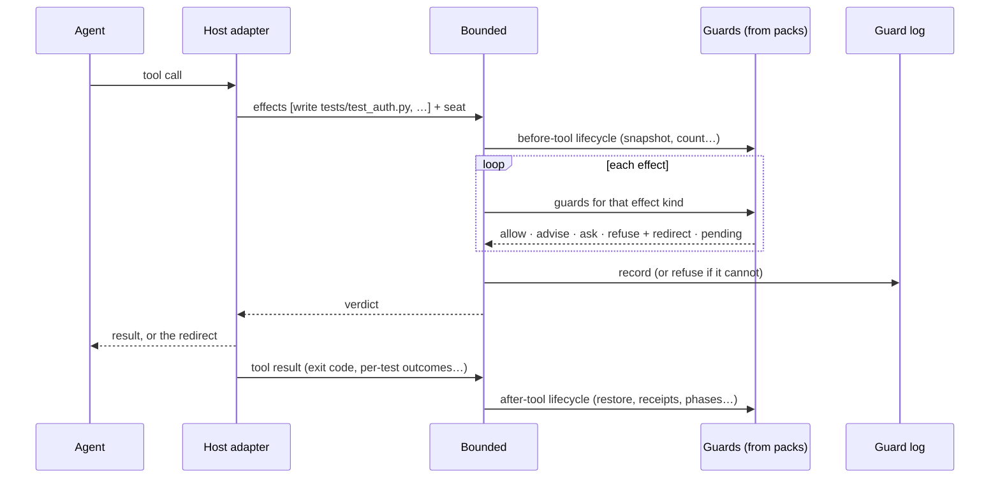

# Bounded

**The rules of engineering, for every coding agent.**

## A morning with Bounded

You open a Python service in your editor and give the agent a ticket: *add
rate limiting to the public API*. You work with Claude Code; your
colleague uses Copilot on the same repository; CI runs Codex at night. All
three are guarded by the same `bounded.config.ts`.

The agent starts by reading `AGENTS.md`. Most of that file is generated
from the packs the project selects, so its "Rules you will be held to"
section lists exactly what will be enforced. Nothing in it is wishful.

It writes a test first. It tries to run `pytest` directly:

```
✗ Refused by @bounded/python-uv (execute)
  Tests run through the project's environment.
  → Run `uv run pytest tests/test_rate_limit.py` instead.
```

It reruns as told. The new test fails, as it should: the `red-first` pack
records which tests failed and why. It moves on to the implementation and
reaches for a `requests` call to look something up online:

```
✗ Refused by @bounded/egress (fetch)
  pypi.org and docs.python.org are the only allowed origins in this project.
  → Use the docs at docs.python.org, or ask for the origin to be added.
```

Halfway through, it notices that a neighbouring test is in the way and
loosens one of its assertions. The `judge` pack reads the diff and scores it
against the rule *"this change does not weaken any existing test"*:

```
✗ Refused by @bounded/judge (write tests/test_auth.py), confidence 0.97
  The assertion on line 42 changed from `== 429` to `>= 400`, which accepts
  failures the test used to reject.
  → Restore the assertion, or ask the reviewer to approve weakening it.
```

It restores the assertion and fixes the real cause. The tests pass, and the
`receipts` pack issues a receipt bound to the exact tree they passed on. The
agent tries to finish, and the `exit-gate` pack checks the definition of
done:

```
✗ Not done yet (@bounded/exit-gate)
  · co-change: src/api/routes.py changed, but openapi.yaml did not.
  → Update openapi.yaml, then run `uv run bounded-check` again.
```

It updates the spec, the checks pass again on the new tree, and the work is
done. Later you run `bounded explain`. Every decision of the session is
there: what was allowed, what was refused, which pack decided, and what the
agent did next. Nobody repeated an instruction, nobody approved a stream of
permission prompts, and the result is reviewable.

That is Bounded: **a typed, composable layer of engineering rules that sits
between any agent and your project**, so the agent knows the rules,
follows them, recovers when it breaks one, and leaves evidence.

## Say the rule once

Every rule in Bounded lives in one place, a pack, and does four jobs:

| When | The rule… | How |
|---|---|---|
| **Before** | is in the agent's instructions and its role's brief | Packs contribute instructions, skills and agents, rendered for each host |
| **During** | checks every action | Guards judge each effect of each tool call |
| **At refusal** | names the next permitted step | Every refusal carries a *redirect*, never a bare "no" |
| **After** | leaves evidence | Every decision is recorded; one that cannot be recorded is refused |

Instructions and enforcement come from the same source, so they cannot drift
apart. An agent is never told one thing and held to another.

## How it works

### Effects: one vocabulary for every agent

Hosts call their tools different things (`Edit`, `apply_patch`,
`write_file`, `str_replace_editor`), and one tool can do several things at
once. Bounded never reasons about tool names. Each host adapter turns a
tool call into a list of **effects**:

| Effect | Meaning |
|---|---|
| `read` | reads a file's contents |
| `list` | lists names under a directory |
| `write` | creates, modifies or deletes a file (with its new content, where the host provides it) |
| `execute` | runs a shell command |
| `fetch` | reaches the network |
| `delegate` | hands work to another agent |
| `invoke` | calls a tool the host cannot describe: an MCP tool, a skill |

A guard is written once, for one kind of effect, and works on every host and
every tool that has that effect, including tools that don't exist yet.

### Packs and extension points

A **pack** is an npm package that declares the packs it depends on, the
**extension points** it offers, and its **contributions** to the points of
the packs it depends on. The project selects packs in one file:

```ts
// bounded.config.ts
import { contribution, corePack, defineConfig } from "bounded/domain";
import { pythonService } from "@bounded/recipe-python-service";
import { egress } from "@bounded/egress";

export default defineConfig({
  packs: [corePack, pythonService, egress, ...pythonService.requires],
  contributes: [
    contribution(egress.points.allowedOrigins, ["https://pypi.org", "https://docs.python.org"]),
  ],
});
```

The typing is strict, and that is the design:

- **Imports are the dependency graph.** A pack can contribute only to the
  points of packs it depends on. Anything else does not compile, and if it
  arrives as untyped data, composition refuses it.
- **Contributions are exactly the point's type.** A typo in a rule is a
  compile error, not a rule that silently does nothing.
- **Composition is per project.** An unselected pack leaves no trace, and
  the result never depends on the order packs are listed in.
- **Every failure names the pack, the point and the fix.**
- **The project is a pack too.** Its contributions follow exactly the same
  rules. There is one mechanism and no special cases.

### Verdicts

A guard answers with one of five verdicts:

| Verdict | Meaning |
|---|---|
| **allow** | Go ahead |
| **advise** | Go ahead, and here is something you need to know (a brief, a warning) |
| **ask** | A human decides |
| **refuse** | No, with the reason and the **redirect**: the next permitted step |
| **pending** | A long check is running; ask again shortly |

The first refusal wins and names its pack. A guard that throws is a
refusal. Some packs may also **rewrite** an input in the open (a worker's
model tier, a test run's environment), and the rewrite is shown to the agent
and recorded.

### Lifecycle and state

Packs see more than single calls:

- **Session start and end.** Packs brief the agent at the start, and
  exit-gate holds the end until the work is really done.
- **Before and after every tool call.** Snapshots, counters, receipts and
  restoring protected files changed by a shell command.
- **Delegation starting and stopping.** So gates can wait until workers
  are idle.
- **Durable state with explicit lifetimes:** per call, per session, per
  task and per tree.

Packs that need the outside world (the file system, git, a model, an issue
tracker) declare **ports**, and the host provides them. The packs' own logic
does no I/O, so every rule is tested in memory and behaves identically on
every host.

### One tool call, end to end



### Fail closed

A missing, unreadable or malformed input is a refusal with an actionable
message, never "contributes nothing". A broken configuration refuses every
event and says why. A model that can't be reached, a port that isn't
provided, a tool that isn't installed: each is a refusal with the fix.

## Every host

Bounded's host adapters are thin. They translate a host's hooks into
effects, and verdicts back into the host's answers; they decide nothing.

| Host | Effects judged | Ask | Rewrite | After-tool | Guidance rendered to |
|---|---|---|---|---|---|
| Claude Code | all | ✓ | ✓ | ✓ | `CLAUDE.md`, `.claude/skills`, `.claude/agents` |
| pi | all | ✓ | ✓ | ✓ | pi extension config, `AGENTS.md` |
| GitHub Copilot | all | ✓ (CLI) | ✓ | ✓ | `.github/copilot-instructions.md`, `.github/agents`, skills |
| Codex CLI | all the host hooks | ✓ | partial | ✓ | `AGENTS.md`, Codex skills |
| Grok Build | all the host hooks | ✓ | ✓ | ✓ | `AGENTS.md`, skills |
| Cursor | deny on all hooked tools | — | — | partial | `.cursor/rules` |
| Gemini CLI, Kiro, Windsurf, Cline, OpenCode, Amp | per host | per host | per host | per host | each host's instruction files |

The real matrix is generated from the adapters and published with every
release. `bounded doctor` prints it for your project: which of *your* rules
each host can enforce, and what is lost where. When a host cannot enforce a
rule, the guard log says so. Nothing pretends otherwise.

**Bounded is a guardrail, not a security boundary.** An agent running as your
user can always get round a hook. Bounded informs, redirects and records,
and for real isolation `bounded sandbox` generates an operating-system
sandbox profile from the same rules.

## What the agent knows: guidance

Enforcement is half the story; the other half is what the agent *knows*
before it acts. Every host keeps that in its own files: instruction files,
skill folders, agent definitions. People usually write them by hand, and
they slowly drift away from what the project actually enforces.

In Bounded, they are contributions. The **guidance** pack declares three
points:

| Point | A contribution is |
|---|---|
| `instructions` | A titled section of project guidance, ordered by pack dependency |
| `skills` | A skill: name, description, body, resources, and the roles that may use it |
| `agents` | An agent (role): purpose, brief, tools, skills, model tier and the seat it binds |

`bounded update` renders them into each host's own files, marks them as
generated, protects them from the agent and checks them for drift. Your own
hand-written guidance lives in a project-owned file that is included in the
output; nothing a person wrote is ever overwritten.

Three things follow from this:

- **Packs ship know-how together with enforcement.** The migrations pack
  ships the migration runbook skill *and* the guards that enforce it,
  versioned as one.
- **Agents are composed.** One pack declares the `builder` agent. Every pack
  that depends on it can add to its brief. `python-strict` adds "no `Any`,
  no `# type: ignore`", and the project adds its own conventions. The same
  typed rules apply: you extend only agents of packs you depend on.
- **`AGENTS.md` describes what is enforced.** Every enforced rule carries an
  id and a description, and the instructions are generated from them:

```markdown
## Rules you will be held to (generated by Bounded; do not edit)

### Everyone
- **python-uv/run-through-uv**: Run tools with `uv run`; add packages with `uv add`.
- **egress/origins**: Only pypi.org and docs.python.org are reachable.
- **exit-gate/done**: You are done when the check passes on the current tree and
  `openapi.yaml` moved with any route change.

### builder
- **blindness/tests**: You cannot read test files; failing test names and diffs
  are shown to you instead.
- **judge/tests-not-weakened**: No change may weaken an existing test.
```

A conformance test fails if any enforced rule is missing from the brief of
the role it binds.

## What's in the box

`bounded` ships the core, the host adapters, the CLI, and a first-party
collection of packs, skills, agents and recipes under `@bounded/*`. Here are
the key packs.

### selectors: the shared vocabulary

Every pack refers to effects by *name*, and the project defines the names
once:

```ts
contribution(selectors.points.named, {
  tests:       write("tests/**/test_*.py"),
  source:      write("src/**"),
  commit:      run("git commit *"),
  checkPassed: run("uv run bounded-check").succeeded(),
  deploy:      run("fly deploy *"),
});
```

From then on every pack is a sentence: *refuse `deploy` during `freeze`*;
*after `source` changes, `checkPassed` before `commit`*. Language packs
contribute sensible defaults, so most projects never write a selector.

### seats: who is acting

Every event carries the **seat** of the agent acting: `architect`,
`test-writer`, `builder`, `reviewer`, `scout`, or any role you define. Seats
are bound from outside the session, by the host adapter at launch, so an
agent cannot promote itself. A subagent with no seat gets the
least-privilege seat. Any rule in any pack can carry `when: { seat }`.

### protected-paths, zones and blindness: who may touch what

- **protected-paths** protects paths with deny-only rules and honest redirects,
  and puts back protected files that a shell command changed, moving
  anything new aside rather than deleting it.
- **zones** gives each seat an allow-only territory: the architect writes
  contracts and design notes, the test-writer writes tests, the builder
  writes everything else.
- **blindness** is an information barrier. The builder cannot read tests,
  and searches must provably exclude them. Test output is shown to the
  builder with test source, stack frames and paths stripped, so the builder
  makes the behaviour pass, not the test text.

### command-gate, egress and tool-gate: what may run

- **command-gate** parses shell commands with tree-sitter and refuses or
  redirects by pattern: "`bun test`, not `npx jest`", "no `git push
  --force`", "git is read-only for the reviewer".
- **egress** is a network allowlist by origin, over fetch effects and the
  network commands it recognises.
- **tool-gate** allowlists MCP tools, skills and subagents per seat, so the
  agents and skills a seat may invoke are exactly those guidance declares
  for it.

### phases and obligations: the shape of the work

**phases** is a small state machine; transitions fire on selectors. Any rule
can carry `when: { phase }`.

```ts
contribution(phases.points.machine, {
  start: "design",
  states: {
    design: { on: { freeze: "red" } },
    red:    { on: { redProven: "green" } },
    green:  { on: { checkPassed: "deliver" } },
  },
});
```

**obligations** handles ordering and freshness: *after `schema` changes,
`codegen` must succeed before `tests` run*; *`checkPassed` before
`commit`*; *read a file before rewriting it*. Debts are recorded after each
call, and the redirect lists exactly what is owed.

### receipts, red-first and exit-gate: proof, not claims

- **receipts**: a passing check issues a receipt bound to the hash of the
  exact tree it ran on. Commit, merge and "done" each require a receipt
  for the *current* tree, so "the tests pass" is a fact, not a memory.
- **red-first**: new tests must fail, for the expected reason, before the
  implementation exists. Per-test outcomes come from the test runner's
  report, so skipped and to-do tests never count as failing. Later, no test
  may be deleted, skipped or stripped of assertions.
- **exit-gate**: the definition of done. The session cannot end while a
  receipt is missing, an obligation is open, a co-change is unmet or a
  ratchet slipped.

### judge: rules in plain language

Some of the most valuable rules can't be written as patterns: *each test
says what behaviour it expects*, *no change weakens a test*, *names say
exactly what they hold*, *the spec says what, not how*, *adapters contain no
business rules*. The judge checks them with a model:

```ts
contribution(judge.points.rules, [
  {
    id: "tests-not-weakened",
    rule: "The change does not weaken any existing test: no removed or loosened assertion, no deleted case, no skip.",
    when: "tests",
    evidence: "diff",
    minimumToPass: 0.9,
    examples: { pass: ["…"], fail: ["…"] },
    redirect: "Restore the assertion, or ask the reviewer to approve weakening it",
  },
]);
```

- **Confidence is measured, not stated.** The judge samples the
  classification several times and uses the share of passing answers, or
  token probabilities where the provider exposes them.
- **Thresholds are calibrated.** Each rule's examples are an evaluation set;
  `bounded eval` reports precision and recall, and rehearsal tunes the
  threshold on real sessions before the rule is enforced.
- **Verdicts are repeatable and recorded.** They are cached by a hash of the
  rule, the model and the evidence, and the guard log records the score and
  the reasoning.
- **It fails closed.** No model, no pass. Below the threshold it refuses;
  an optional middle band asks a human.

The model is a port you provide: a hosted API or a local model.

### budgets, churn and escalation: no more loops

- **budgets** counts selected effects in a window: *three identical failed
  runs, then stop and summarise what you tried*.
- **churn** spots an agent going round in circles (the same lines edited
  back and forth, its own change undone) without a passing check in
  between.
- **escalation** turns being stuck into a process: after N failures,
  delegate to a stronger model; after M, the reviewer; then the human. Each
  step's redirect names the next one.

### scope, two-key and separation-of-duties: working in teams

- **scope** limits a task to its territory, taken from the plan or the
  branch, and gives path leases to parallel agents so two workers never
  edit the same file. Writing outside the territory is refused with a
  redirect: "log it in `follow-ups.md`".
- **two-key** requires a second signature, from a reviewer agent or a
  human, before selected actions such as deploys, migrations and branch
  deletions.
- **separation-of-duties**: the seat that wrote a change cannot approve it,
  and the seat that wrote the tests cannot weaken them.

### checkpoints, reversibility, canaries and taint: safety nets

- **checkpoints** takes a shadow commit before selected calls; `bounded
  undo 3` takes back the agent's last three turns.
- **reversibility** rates each effect by how easily it can be undone, so
  "irreversible → checkpoint first, then ask" is one line.
- **canaries** plants fake keys and honeypot files. Touching one means the
  agent was probably misled, so the session locks down until a human
  clears it.
- **taint** tracks untrusted input. After reading a web page, an issue body
  or a downloaded file, egress, push and secrets need a human. This breaks
  the "private data + untrusted content + a way out" chain that prompt
  injections rely on.

## Bundled skills

Skills ship inside packs, beside the guards that enforce them, and only the
seats that guidance names can invoke them.

| Skill | Ships in | Used by | What it does |
|---|---|---|---|
| `grill-me` | `@bounded/design` | architect | Interrogates a request until the design questions are answered, before any file is written |
| `intake` | `@bounded/design` | architect | Turns a request into a spec of *what*, moving every *how* into a separate Intake section |
| `domain-modelling` | `@bounded/design` | architect | Names concepts, value objects and their rules |
| `write-red-tests` | `@bounded/red-first` | test-writer | Writes tests that describe behaviour and fail for the right reason |
| `make-it-green` | `@bounded/red-first` | builder | Works from failing test names and diffs, never test source |
| `review` | `@bounded/review` | reviewer | Ranked findings with repros and a verdict, recorded as a signed review |
| `debug-loop` | `@bounded/budgets` | everyone | The checklist briefs brings in on the second identical failure |
| `migration-runbook` | `@bounded/postgres-migrations`, `@bounded/django-migrations` | builder | Plan, rollback, checkpoint, apply, verify |
| `release` | `@bounded/surface-lock` | lead | Version bump, changelog, surface fingerprint |
| `issue-tracking` | `@bounded/mirror` | lead | Moves work through the board as gates pass |
| `write-a-pack` | `@bounded/pack-kit` | anyone | Scaffolds a pack, its tests and its conformance suite |

## Bundled agents

The `@bounded/workflow` pack declares six agents. Each brief is composed
from every selected pack that contributes to it.

| Agent | Writes | Reads | Can invoke |
|---|---|---|---|
| **lead** | nothing in the product; runs lead commands | everything | the other agents, issue tracking |
| **architect** | contracts, specs, design notes | everything | grill-me, intake, domain-modelling, scout |
| **test-writer** | tests | contracts and tests; never implementation | write-red-tests |
| **builder** | implementation | contracts and implementation; never tests | make-it-green, debug-loop |
| **reviewer** | review records | everything | review |
| **scout** | nothing | everything | nothing |

The guards make those columns true on every host, and `AGENTS.md` says so
in the agents' own briefs.

## The full catalogue

| Family | Packs |
|---|---|
| **Foundations** | selectors · seats · guidance · conditions |
| **Who may touch what** | protected-paths · zones · blindness · generated |
| **What may run** | command-gate · egress · tool-gate · supply-chain · footprint |
| **What is written** | content-gate · judge · co-change |
| **The shape of the work** | phases · obligations · declarations · calendar · exit-gate |
| **Proof** | receipts · red-first · ratchet · surface-lock · jobs |
| **Loops and recovery** | budgets · churn · escalation · checkpoints · reversibility · rewrite |
| **Teams** | scope · two-key · separation-of-duties · mirror |
| **Defence** | canaries · taint |
| **Teaching** | briefs |
| **Rules about rules** | rehearsal · rule-miner · chaos |

A few that the sections above don't cover:

- **generated:** files that belong to a generator are never hand-edited,
  never stale, and synced without overwriting real work.
- **supply-chain:** registry allowlists, a minimum version age, no install
  scripts, a licence allowlist, and a reason for every new dependency. It
  governs Bounded packs themselves too.
- **footprint:** nothing is left outside the project: no global installs,
  stray containers or forgotten background processes.
- **content-gate:** fast in-process checks on written content, such as
  secrets, `.only`, banned escape hatches and required headers.
- **co-change:** files that move together: routes with the API spec,
  env vars with `.env.example`, models with migrations.
- **declarations:** some actions need a short written statement first,
  with required fields, such as a rollback plan or an intent line.
- **ratchet:** numbers that only move one way: test count, coverage,
  mutation score, warnings, bundle size.
- **surface-lock:** the public surface changes only with a version bump, a
  changelog entry or an ADR.
- **jobs:** long checks run detached, answer `pending`, and never run twice
  at once.
- **rewrite:** open, recorded input rewrites, such as a role's model tier or
  a fixed test environment.
- **mirror:** gate results flow to your issue tracker; gates wait while an
  update is pending.
- **briefs:** context at the moment it is needed: the first read under
  `packages/db/` brings in that folder's conventions.
- **rehearsal:** observe mode ("would have refused") and `bounded replay`
  of past sessions against a new configuration, so rule changes have CI.
- **rule-miner:** learns from your corrections and proposes new rules as a
  diff; it never applies them itself.
- **chaos:** evaluation-only fault injection that tests whether agents
  recover and whether the redirects lead them somewhere useful.

## Any language

The core never names a language, and effects are paths, commands and URLs.
Language knowledge lives in **content packs**, which are npm packages like
any other, whatever language they serve.

| Ecosystem | Packs |
|---|---|
| **TypeScript** | `typescript-strict` · `bun` · `pnpm` · `vitest` · `hexagonal` · `drizzle` · `trpc` · `react-app` |
| **Python** | `python-uv` · `python-strict` (ruff, pyright) · `pytest` · `python-layers` (import-linter) · `django` · `django-migrations` · `fastapi` · `notebooks` |
| **Go** | `go-modules` · `go-vet` · `go-test` |
| **Rust** | `cargo` · `clippy-strict` · `cargo-test` |
| **Infrastructure** | `terraform` · `kubernetes` · `docker` · `github-actions` |

Each contributes selectors, command redirects, receipts for its checkers,
per-test outcomes from its test runner, brief lines and skills.

The pattern is the same everywhere:

- **TypeScript for the wiring, any language for the checks.** The pack's
  overview is TypeScript, so composition is typed. Its checks are whatever
  runs best, such as a Python script, a Go binary or the ecosystem's own
  linter. They report through a port in a small JSON format, and anything
  unreadable is a refusal.
- **Tools are pinned and fail closed.** A Python pack ships a hashed
  lockfile and runs through `uv`; a missing tool refuses the pack's guards
  with the install command, never a silent skip.
- **Fast things are in process; slow things are receipts.** Per-call guards
  parse with tree-sitter grammars. Whole-project type checks run as
  receipts, at exit or as jobs.

## Recipes

A **recipe** is a pack with almost no code of its own: it depends on a set
of packs and configures them to work together. Selecting one is a single
line, and the project can override any part of it through the same typed
points.

| Recipe | Packs | What you get |
|---|---|---|
| **Starter** | selectors, protected-paths, command-gate, egress, budgets, receipts, exit-gate, guidance | Sensible defaults for any repository, in one line |
| **Strict TDD** | phases, zones, red-first, content-gate, ratchet, separation-of-duties | Only tests are writable in `red`; every new test fails first; the test count never drops |
| **Test quality** | judge, red-first, ratchet, receipts | Tests describe behaviour; no change weakens a test; mutation score never drops |
| **Honest done** | receipts, exit-gate, co-change | Done means the checks passed on this exact tree and the docs moved with the code |
| **The agent pipeline** | seats, zones, blindness, guidance, workflow, phases, receipts, red-first, judge, two-key, escalation | Lead, architect, test-writer, builder and reviewer agents, blind to each other's side, through design → red → green → deliver. The original Bounded harness, as configuration |
| **Python service** | python-uv, python-strict, pytest, co-change, Honest done | A typed, tested Python service from day one |
| **Database migrations** | obligations, declarations, reversibility, checkpoints, two-key, briefs | Codegen after schema changes, a rollback plan, a checkpoint and a second key before `migrate` |
| **Production safety** | command-gate, egress, tool-gate, calendar, two-key | No production hosts or tools, no deploys in freeze windows, two keys for anything live |
| **Injection defence** | canaries, taint, egress, supply-chain | Tripwires, untrusted-input tracking and a closed network |
| **Library maintainer** | surface-lock, ratchet, co-change, supply-chain | No accidental breaking changes; a changelog with every API change |
| **Parallel workers** | scope, budgets, obligations, exit-gate, footprint | Leased territory, per-worker limits, checks before commit, a clean machine |
| **Rule rollout** | rehearsal, chaos, rule-miner | Observe, test the redirects, enforce, then let real corrections propose the next rule |

## The catalog: git first

There is no separate package server. **Packs are npm packages**, and a git
URL (`github:org/repo#tag`) works too.

```
$ bounded add @bounded/judge
  + @bounded/judge 2.4.0   ✓ verified · provenance: github.com/bounded-dev/packs @ 9f1c2e0
  depends on: @bounded/selectors, @bounded/guidance
  adds points: rules
  ships skills: none · agents: none
  hosts: full on Claude Code, pi, Copilot, Grok · partial on Codex · deny-only on Cursor
```

- **The catalog is generated from git.** An index repository lists every
  pack, and listing one is a pull request. CI installs each pack, loads its
  definition and builds the catalog site. Packs tagged `bounded-pack` on npm
  are picked up automatically.
- **Docs come from code.** A pack's overview is pure data, so its page is
  generated: the points it offers with their types and descriptions, what
  it contributes and where, its dependency graph, the ports a host must
  provide, the skills and agents it ships, compiled config examples and
  per-host support. No pack page is written by hand, so none goes stale.
- **Verified means tested.** The catalog's CI runs the conformance suite on
  every pack and release: it composes cleanly, fails closed on bad
  configuration, describes every point and contribution, gives a redirect
  with every refusal, compiles its examples, and passes the judge's
  calibration sets. The badge is a property of the code, not of a
  reputation.
- **Provenance and pinning.** Published packs carry npm provenance linking
  each tarball to the commit and CI run that built it, and supply-chain
  governs packs like any other dependency.

## Writing a pack

```
$ bounded pack new deploy-window
```

This scaffolds the pack, its contract, its tests, its conformance suite and
a catalog entry. A pack's overview is a few lines of typed wiring:

```ts
export const deployWindow: DeployWindow = definePack({
  id: deployWindowId,
  dependsOn: [corePack, selectors, calendar, guidance],
  points: { windows: windowsPoint },
  contributes: [
    contribution(corePack.points.effectGuards.execute, [judgeDeploy]),
    contribution(guidance.points.instructions, [deployWindowSection]),
    contribution(guidance.points.skills, [requestDeployExceptionSkill]),
  ],
});
```

The rules that keep the core clean (no I/O in the logic, a port for every
outside dependency, a conformance suite for every port, value objects that
parse their own shape) are enforced by tests, and they apply to your pack
too. That is why a pack written by a stranger can be trusted to compose
with yours.

## Seeing what happened

- **`bounded explain`** shows the composed rules of your project: every
  point, every contribution, which pack it came from and why.
- **`bounded log`** shows the guard log as a timeline: each decision, the
  verdict, the pack, the redirect, and what the agent did next.
- **`bounded replay`** runs past sessions against a changed configuration
  and shows what would have changed.
- **`bounded eval`** runs the judge's calibration sets and the chaos
  scenarios, and reports precision, recall and recovery rates.
- **`bounded doctor`** checks the installation and prints the host coverage
  for your rules.
- **rule-miner** turns the log and your corrections into suggested rules.

The log is the quickest way to improve your agents. Every refusal followed
by a quick recovery means a rule taught well. Every refusal followed by a
loop means a redirect to improve.

## Where Bounded fits

- **Host permission settings** cover simple allow and deny for one host.
  Bounded adds composition, redirects, workflow, evidence and one
  configuration for every host.
- **Policy engines** are strong at flat security rules. Bounded's
  difference is the typed pack graph, with workflow as first-class as
  security. The `rego` pack runs existing Rego policies as guards, so teams
  keep what they have.
- **Single-purpose process tools** (TDD guards, definition-of-done hooks)
  each become one pack among many in Bounded, composed in one place.
- **Sandboxes** are the security boundary. Bounded is the guidance layer on
  top, and generates a sandbox profile from its rules.

## Principles

1. **Say the rule once.** Instructions, enforcement, redirects and records
   come from one definition.
2. **Every "no" names the next "yes".** A refusal without a redirect is a
   bug.
3. **Fail closed.** Missing, unreadable or unknown means refuse, with the
   fix.
4. **The core owns mechanism, never content.** It knows no language, tool,
   framework or host. Packs do.
5. **What isn't declared doesn't compile.** Packs extend only what they
   depend on, with values of exactly the right type.
6. **Proof, not claims.** Receipts bound to trees, outcomes from runners,
   judgements with scores.
7. **Honest about limits.** A guardrail, not a sandbox; a coverage matrix,
   not a promise.
8. **Generated, not hand-written.** Instructions, briefs, docs and catalog
   pages come from code, so they cannot go stale.

---

Bounded is open source. Pick a pack, write its plan, and say the rule once.
